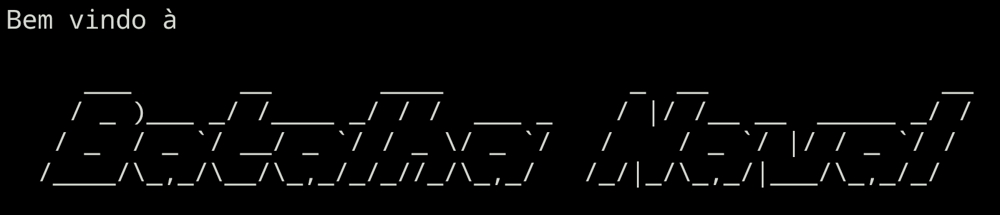

 

Projeto final da disciplina algoritmos e programação estruturada, do curso Sistemas para Internet - Instituto Federal da Paraíba (@ifpb) Campus João Pessoa-PB.

## Descrição do Projeto

Batalha Naval é um jogo de tabuleiro em que os dois jogadores têm de adivinhar onde estão localizados os navios do oponente. O objetivo é derrubar primeiro todos os navios do adversário.

Desenvolver um programa, utilizando Python, que simule o jogo Batalha Naval, com dois jogadores, onde cada um irá atacar a frota de navios do outro.

## Requisitos

O tabuleiro de cada jogador deverá ser representado por uma matriz quadrada de ordem 8, sendo as linhas e as colunas identificadas por letras (A a H).

A frota de cada jogador será composta por navios, onde cada um deles ocupará uma célula da matriz.

A quantidade de navios da frota será igual para ambos jogadores e deverá ser definida pelo usuário no início de jogo (máximo de 6).

Ao ser iniciado um novo jogo, a frota de cada jogador deverá ser posicionada no respectivo tabuleiro de forma aleatória pelo computador. Essa alocação deverá ser feita colocando-se a letra “N” na célula onde ele estiver posicionado. Obs: um navio não pode ficar encostado em outro (nem adjacente e nem diagonal).

Após os navios terem sido posicionados, o jogo continua numa série de tiros, que consiste no jogador escolher uma coordenada (linha x coluna) para tentar atingir algum navio do oponente.

Se o tiro for certeiro deverá aparecer a palavra “FOGO” e na posição do tiro ser colocada a letra “F”. Esse mesmo jogador continuará atirando até errar.

Caso contrário, deverá aparecer a palavra “ÁGUA” e na posição do tiro ser colocada a letra “A”. Nesse caso, a vez de jogar passará para o outro jogador.

Os dois tabuleiros devem ficar sempre visíveis na tela. Vale ressaltar que, inicialmente, as frotas não devem aparecer nos tabuleiros, irão aparecer gradativamente à medida que os navios forem sendo atingidos.

O jogo é encerrado quando um jogador afundar todos os navios do seu oponente.

ATENÇÃO:

1. Para fins de teste, o programa deverá permitir tornar visível as frotas.
2. O programa também deverá permitir salvar, em arquivo texto, um jogo em andamento, bem como carregar o arquivo de um jogo salvo anteriormente para que este possa ser continuado.

## Tecnologias utilizadas

## Autores

Este projeto foi desenvolvido por:

Luiz Fernando - [GitHub](https://github.com/LuizFernando12) ` `
Marcelo Bruno - [GitHub](https://github.com/marceelobruno) ` `
Lucas Kaique - [GitHub](https://github.com/LucasKaiquee)

## Contribuição

Este é um projeto acadêmico e não requer contribuições no momento.

## Licença

Este projeto está licenciado sob a [MIT License](LICENSE).
